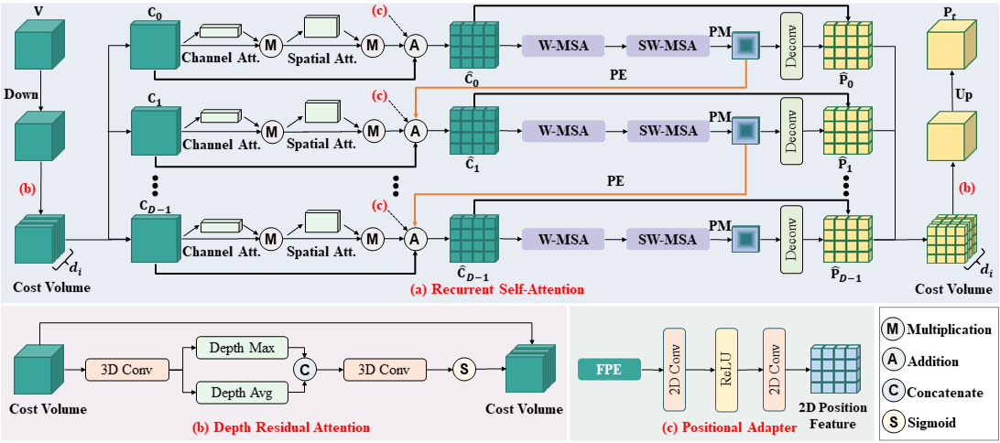
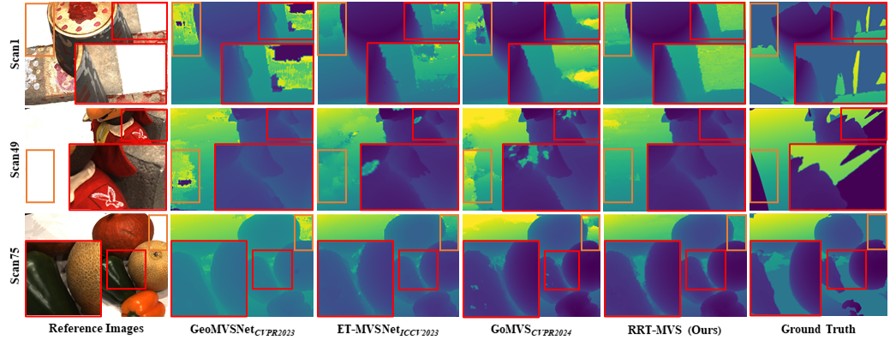

# **RRT-MVS**

## [Paper](https://ojs.aaai.org/index.php/AAAI/article/view/32418) | [Pretrained Models](https://drive.google.com/drive/folders/1D6qCEG-Iqy55zbcuXN7RviiCYEp0QAmQ?usp=sharing)

> RRT-MVS: Recurrent Regularization Transformer for Multi-View Stereo  
> Authors: Jianfei Jiang, Liyong Wang, Haochen Yu, Tianyu Hu, Jiansheng Chen, Huimin Ma<sup>*</sup>  
> Institute: University of Science and Technology Beijing  
> AAAI 2025  

## Abstract
Learning-based multi-view stereo methods aim to predict depth maps for reconstructing dense point clouds. These methods rely on regularization to reduce redundancy in the cost volume. However, existing methods have limitations: CNN-based regularization is restricted to local receptive fields, while Transformer-based regularization struggles with handling depth discontinuities. These limitations often result in inaccurate depth maps with significant noise, particularly noticeable in the boundary and background regions. In this paper, we propose a Recurrent Regularization Transformer for Multi-View Stereo (RRT-MVS), which addresses these limitations by regularizing the cost volume separately for depth and spatial dimensions. Specifically, we introduce Recurrent Self-Attention (R-SA) to aggregate global matching costs within and across the cost maps and filter out noisy feature correlations. Additionally, we present Depth Residual Attention (DRA) to aggregate depth correlations within the cost volume and a Positional Adapter (PA) to enhance 3D positional awareness in each 2D cost map, further augmenting the effectiveness of R-SA. Experimental results demonstrate that RRT-MVS achieves state-of-the-art performance on the DTU and Tanks-and-Temples datasets. Notably, RRT-MVS ranks first on both the Tanks-and-Temples intermediate and advanced benchmarks among all published methods.

### Recurrent Regularization Transformer
<p align="center">

</p>


## Installation

```bash
conda create -n rrtmvsnet python=3.10.8
conda activate rrtmvsnet
pip install -r requirements.txt
pip install torch==1.13.1+cu116 torchvision==0.14.1+cu116 torchaudio==0.13.1 -f https://download.pytorch.org/whl/torch_stable.html
```

## Data Preparation

#### 1. DTU Dataset

**Training data**. We use the same DTU training data as mentioned in MVSNet and CasMVSNet. Download [DTU training data](https://drive.google.com/file/d/1eDjh-_bxKKnEuz5h-HXS7EDJn59clx6V/view) and [Depth raw](https://virutalbuy-public.oss-cn-hangzhou.aliyuncs.com/share/cascade-stereo/CasMVSNet/dtu_data/dtu_train_hr/Depths_raw.zip). Unzip and organize them as:
```
dtu_training                     
    ├── Cameras                
    ├── Depths   
    ├── Depths_raw
    └── Rectified
```


**Testing Data**. Download [DTU testing data](https://drive.google.com/file/d/135oKPefcPTsdtLRzoDAQtPpHuoIrpRI_/view). Unzip it as:
```
dtu_testing                                       
    ├── scan1   
    ├── scan4
    ├── ...
```

#### 2. BlendedMVS Dataset

Download [BlendedMVS](https://drive.google.com/file/d/1ilxls-VJNvJnB7IaFj7P0ehMPr7ikRCb/view) and unzip it as:

```
blendedmvs                          
    ├── 5a0271884e62597cdee0d0eb                
    ├── 5a3ca9cb270f0e3f14d0eddb   
    ├── ...
    ├── training_list.txt
    ├── ...
```

#### 3. Tanks and Temples Dataset

Download [Tanks and Temples](https://drive.google.com/file/d/17mTgTzjPV1KsazabRIU0J3p0_ogufi5R/view?usp=sharing) processed data by ET-MVSNet and MVSFormer++ and unzip it as:

```
tanksandtemples                          
       ├── advanced                 
       │   ├── Auditorium       
       │   ├── ...  
       └── intermediate
           ├── Family       
           ├── ...          
```

Evaluation with 21 input views with [new_pair.txt](https://1drv.ms/f/s!AnZvbwfkzTydkk0TEvkA7M8cRY92?e=ZjncP5) provided by [MVSFormer++](https://github.com/maybeLx/MVSFormerPlusPlus).


## Training

### Training on DTU (NVIDIA RTX 3090 GPUs, 24G)

To train the model on DTU, specify ``DTU_TRAINING`` in ``./scripts/train_dtu.sh`` first and then run:
```
bash scripts/train_dtu.sh
```
After training, you will get model checkpoints in `./checkpoints/dtu`.

### Finetune on BlendedMVS (NVIDIA RTX A6000 GPUs, 48G)

To fine-tune the model on BlendedMVS, you need specify `BLD_TRAINING` and `BLD_CKPT_FILE` in `./scripts/train_bld.sh` first, then run:
```
bash scripts/train_bld.sh
```


## Testing

### Testing on DTU

For DTU testing, we use the model ([pretrained model](https://drive.google.com/drive/folders/1D6qCEG-Iqy55zbcuXN7RviiCYEp0QAmQ?usp=sharing)) trained on DTU training dataset. Specify `DTU_TESTPATH` and `DTU_CKPT_FILE` in `./scripts/test_dtu.sh` first, then run the following command to generate point cloud results.
```
bash scripts/test_dtu.sh
```
For quantitative evaluation, download [SampleSet](http://roboimagedata.compute.dtu.dk/?page_id=36) and [Points](http://roboimagedata.compute.dtu.dk/?page_id=36) from DTU's website. Unzip them and place `Points` folder in `SampleSet/MVS Data/`. The structure is just like:
```
SampleSet
├──MVS Data
      └──Points
```

Specify `datapath`, `plyPath`, `resultsPath` in `evaluations/dtu/BaseEvalMain_web.m` and `datapath`, `resultsPath` in `evaluations/dtu/ComputeStat_web.m`, then run the following command to obtain the quantitative metics.
```
cd evaluations/dtu
matlab -nodisplay
BaseEvalMain_web 
ComputeStat_web
```
The matlab evaluation code is slow, we recommend [Fast DTU Evaluation Using GPU with Python](https://github.com/Gwencong/Fast-DTU-Evaluation) for fast validation, and the final result reported in paper is obtained by official matlab code.

### Testing on Tanks and Temples
We recommend using the finetuned model ([pretrained model](https://drive.google.com/drive/folders/1D6qCEG-Iqy55zbcuXN7RviiCYEp0QAmQ?usp=sharing)) to test on Tanks and Temples benchmark. Similarly, specify `TNT_TESTPATH` and `TNT_CKPT_FILE` in `scripts/test_tnt_inter.sh` and `scripts/test_tnt_adv.sh`. To generate point cloud results, just run:
```
bash scripts/test_tnt_inter.sh
```
```
bash scripts/test_tnt_adv.sh
``` 
For quantitative evaluation, you can upload your point clouds to [Tanks and Temples benchmark](https://www.tanksandtemples.org/).


## Results

### Qualitative Results  
  

### Quantitative Results
Our results on DTU and Tanks and Temples (T&T) Dataset are listed in the tables.

| DTU | Acc. ↓ | Comp. ↓ | Overall ↓ |
| ----------- | ------ | ------- | --------- |
| Ours   | 0.309 | 0.261  | 0.285    |

| T&T (Intermediate) | Mean ↑ | Family | Francis | Horse | Lighthouse | M60   | Panther | Playground | Train |
| ------------------ | ------ | ------ | ------- | ----- | ---------- | ----- | ------- | ---------- | ----- |
| Ours       | 68.16  | 82.54 | 72.31 | 61.44 | 69.89 | 65.35 | 68.88 | 64.45| 60.48 |

| T&T (Advanced) | Mean ↑ | Auditorium | Ballroom | Courtroom | Museum | Palace   | Temple |
| ------------------ | ------ | ------ | ------- | ----- | ---------- | ----- | ------- |
| Ours       | 43.29 | 30.95 | 46.42 | 41.13 | 55.46 | 37.63 | 48.12 |

## Citation
If you find this work useful in your research, please consider citing the following preprint:
```bibtex
@inproceedings{jiang2025rrt,
  title={RRT-MVS: Recurrent Regularization Transformer for Multi-View Stereo},
  author={Jiang, Jianfei and Wang, Liyong and Yu, Haochen and Hu, Tianyu and Chen, Jiansheng and Ma, Huimin},
  booktitle={Proceedings of the AAAI Conference on Artificial Intelligence},
  volume={39},
  number={4},
  pages={3994--4002},
  year={2025}
}
```


## Acknowledgements
Our work is partially based on these opening source work: 
- [MVSNet](https://github.com/YoYo000/MVSNet)
- [MVSNet-pytorch](https://github.com/xy-guo/MVSNet_pytorch)
- [CasMVSNet](https://github.com/alibaba/cascade-stereo)
- [MVSTER](https://github.com/JeffWang987/MVSTER)
- [ET-MVSNet](https://github.com/TQTQliu/ET-MVSNet)
- [MVSFormer++](https://github.com/maybeLx/MVSFormerPlusPlus)
- [SwinTransformer](https://github.com/microsoft/Swin-Transformer)

We appreciate their contributions to the MVS community.
